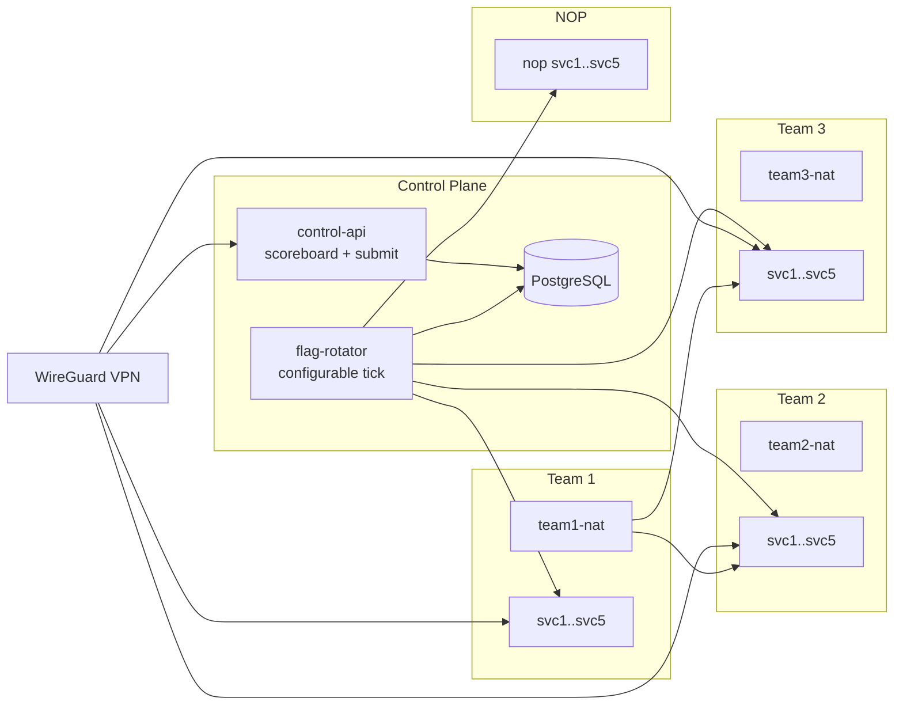

[← README](../README.md) · [Architecture](architecture.md) · [Challenges](challenges.md) · [Data Schema](schema.md) · [Local Runbook](local-runbook.md) · [Hetzner Runbook](hetzner-runbook.md)

---

# KosSim Architecture

This page describes each major platform element and the reason it exists, so operations and scoring stay predictable during competitions.

## Requirement Mapping: What and Why

| # | Element | What It Does | Why It Is Needed |
| --- | --- | --- | --- |
| 1 | Visible scoring | `control-api` exposes `/scoreboard` (HTML) and `/api/v1/scoreboard` (JSON). | Teams and organizers need one trusted source of score truth. |
| 2 | Scriptable flag submit | `/api/v1/flags/submit` accepts token-authenticated flag batches. | Automation is required for realistic A/D competition speed. |
| 3 | Per-minute flag rotation | `flag-rotator` creates one new active flag per team-service every 60s. | Stops replay and forces teams to keep exploiting live targets. |
| 4 | 5 services per team | Each team stack has `svc1..svc5` with the same vulnerabilities. | Fairness: equal attack surface for all teams. |
| 5 | NOP host | Dedicated always-on stack for testing and baseline checks. | Lets organizers validate tooling without affecting team scoring. |
| 6 | Shared network | Control plane, team stacks, and NOP run on one private competition network. | Required for rotator/checkers reachability and realistic lateral traffic. |
| 7 | NAT identity | Team attacks pass through `teamX-nat`, targets observe NAT source. | Prevents leaking internal attacker container IPs to opponents. |
| 8 | Team VPN access | WireGuard provides per-team profiles into private subnet. | Secure remote access while keeping competition network private. |

## High-Level Topology Diagram

If the diagram does not render, verify outbound internet access to `cdn.jsdelivr.net`.

### Round Engine

**What:** Rotator computes round IDs and pushes fresh flags to all team services on each configured tick.

**Why:** Ensures active offense/defense loop and limits stale flag abuse.

### Score Engine

**What:** Submit API validates token, freshness, ownership, and duplicate state.

**Why:** Keeps scoring deterministic and auditable under heavy automation.

### User-Friendly Rounds

**What:** Leaderboard displays rounds as `1,2,3,...` while backend keeps raw round IDs.

**Why:** Humans read progression clearly; backend still retains exact time mapping.

### Tick Refresh

**What:** Dashboard auto-refreshes at tick boundary and runs countdown continuously.

**Why:** Spectators and players always see current ranking immediately after rotations.

## Runtime Sequence

1. Rotator opens current round and rotates team flags.
2. Teams exploit opponent services and extract flags.
3. Teams submit flags through submit API.
4. API accepts only valid current-tick flags and updates scores.
5. Leaderboard refreshes on tick reset and displays next round counter.

> **Note:** Scoring default: each captured flag is worth a fixed value (base `10` divided by the number of flag stores for the service); points are cumulative and do not decay, and every team that captures a flag scores independently. Defense and SLA are calculated across the retention window.
