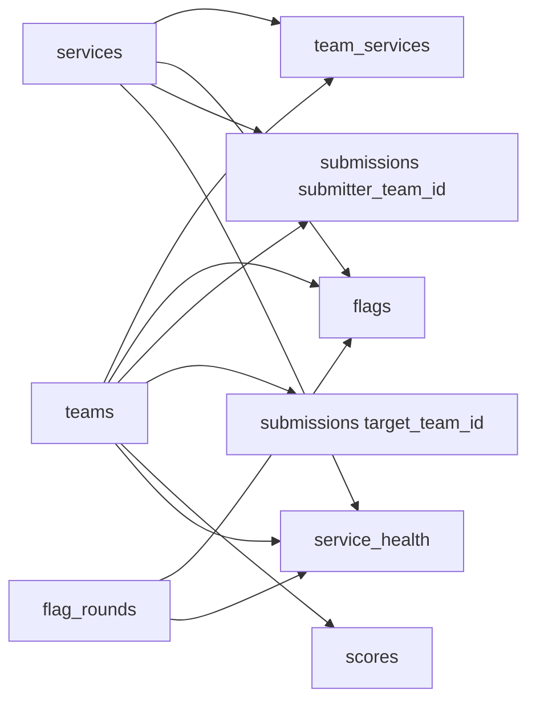

[← README](../README.md) · [Architecture](architecture.md) · [Challenges](challenges.md) · [Data Schema](schema.md) · [Local Runbook](local-runbook.md) · [Hetzner Runbook](hetzner-runbook.md)

---

# Data Schema

Schema source: `platform/control/app/schema.sql`. This section explains what each table stores and why it exists in the scoring pipeline.

## Entity Purpose Matrix

| Table | What It Stores | Why It Is Needed |
| --- | --- | --- |
| `teams` | Team identity, submit token, NAT alias, NOP flag. | Defines who can submit and how teams appear in topology/scoreboard. |
| `services` | Canonical service names (`svc1..svc5`). | Single source for service catalog consistency. |
| `team_services` | Team-to-service instance mapping with host/port and enabled state. | Lets rotator/checkers find exact targets per team. |
| `flag_rounds` | Round timing metadata and rotation interval. | Creates auditable round boundaries for fairness. |
| `flags` | Generated flags, round relation, active/inactive state, expiry. | Tracks current flag truth and prevents collisions/replays. |
| `submissions` | Every submitted flag with result and source IP. | Primary audit trail for scoring decisions and disputes. |
| `scores` | Attack, defense, SLA, total per team. | Optimizes leaderboard reads and preserves score history semantics. |
| `service_health` | Per-round up/down status for each team-service. | Supports uptime points and reliability analysis. |

## Scoring and Round Rules

### Score Formula

`team_total = sum(service_total)`

`service_total = sla_ratio * (attack + defense + uptime - hacked_penalty)`

- Successful attack: attacker receives fixed attack points per captured flag (base `10` divided by the number of flag stores), cumulative and non-decaying.
- Successful defense: service owners are rewarded for retained, retrievable flags across the retention window.
- Uptime: service owners receive SLA points from checker health and retained flag availability.
- SLA is calculated from service health and flag availability over the retention window.

### Round Semantics

- Raw backend rounds are derived from UNIX time windows.
- Leaderboard displays human round counter `1,2,3,...`.
- Only current-tick flags are accepted for scoring.
- Local default tick length is `120s`; production deployments can set `ROTATION_SECONDS`.

## ER Overview

Diagram should render automatically. If not, check connectivity to the Mermaid CDN.

## Submission Result States

| Result | What It Means | Why It Matters |
| --- | --- | --- |
| `accepted` | Valid current-tick opponent flag. | Scores points and drives rank changes. |
| `duplicate` | Flag already submitted by same team. | Blocks replay inflation. |
| `stale_round` | Flag from previous tick. | Enforces time-bounded exploitation. |
| `own_flag` | Team submitted its own service flag. | Prevents self-farming. |
| `nop_target` | Flag belongs to NOP stack. | Keeps test systems out of competition scoring. |
| `invalid` | No active matching flag found. | Catches malformed or random submissions. |
| `round_limit` | Accepted cap exceeded when configured. | Supports rule variations for event formats. |
